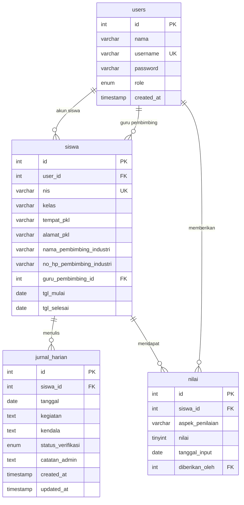

# SIMONA — Sistem Monitoring dan Nilai PKL

Aplikasi web untuk memantau kegiatan Praktik Kerja Lapangan (PKL) siswa SMK.
Dibangun dengan PHP native, MySQL, dan Bootstrap 5.

---

## Fitur

### Admin (Guru Pembimbing)
- Login & logout dengan proteksi session
- Dashboard: ringkasan statistik + jurnal pending
- Kelola data siswa (tambah, edit, hapus) + pencarian & pagination
- Verifikasi / tolak jurnal harian siswa + beri catatan
- Input & edit nilai per aspek (Kedisiplinan, Kompetensi, Sikap, Kerja Sama)
- Rekap laporan: filter, export CSV, dan cetak

### Siswa
- Dashboard: info PKL + statistik jurnal + nilai rata-rata
- CRUD jurnal harian (jurnal terverifikasi dikunci)
- Lihat status verifikasi & catatan guru
- Lihat nilai per aspek dengan predikat A/B/C/D

---

## Tech Stack

| Komponen | Teknologi |
|----------|-----------|
| Backend  | PHP 8.x native (PDO, tanpa framework) |
| Database | MySQL / MariaDB |
| Frontend | Bootstrap 5 + Bootstrap Icons |
| Dev      | XAMPP (Apache + MySQL) |

---

## Cara Instalasi (XAMPP)

1. Clone repo ke folder `htdocs`:
   ```bash
   git clone https://github.com/sandygifta-ui/Sistem-Monitoring-PKL.git Monitoring-PKL
   ```

2. Salin file konfigurasi database:
   ```bash
   cp config/database.example.php config/database.php
   ```

3. Sesuaikan `config/database.php` (host, user, password sesuai XAMPP kamu).

4. Import database lewat **phpMyAdmin**:
   - Buka `http://localhost/phpmyadmin`
   - Tab **Import** → pilih file `database/monitoring_pkl.sql` → klik **Go**

5. Reset password akun demo (jalankan sekali):
   ```
   http://localhost/Monitoring-PKL/database/reset_password.php
   ```

6. Akses aplikasi:
   ```
   http://localhost/Monitoring-PKL
   ```

---

## Akun Demo

| Role  | Username | Password  |
|-------|----------|-----------|
| Admin | admin    | admin123  |
| Siswa | siswa1   | siswa123  |
| Siswa | siswa2   | siswa123  |

---

## Struktur Folder

```
Monitoring-PKL/
├── admin/
│   ├── akun/          # Kelola akun guru
│   ├── jurnal/        # Verifikasi jurnal
│   ├── laporan/       # Rekap & export
│   ├── nilai/         # Input nilai
│   ├── siswa/         # CRUD data siswa
│   └── dashboard.php
├── siswa/
│   ├── jurnal/        # CRUD jurnal harian
│   ├── nilai/         # Lihat nilai
│   └── dashboard.php
├── auth/              # Login & logout
├── config/            # Konfigurasi DB & app
├── database/          # File SQL
├── includes/          # Helper (db, auth, csrf, fungsi)
└── index.php          # Redirect ke login
```

---

## ERD



---

## Panduan Deploy ke InfinityFree

1. **Buat akun** di [infinityfree.com](https://infinityfree.com)
2. **Buat hosting** baru → catat nama database, user DB, dan password DB
3. **Upload file** via File Manager atau FTP:
   - Upload semua folder kecuali `.git/`
   - Upload `config/database.php` (sudah diisi kredensial InfinityFree)
4. **Import database**:
   - Buka phpMyAdmin InfinityFree
   - Import file `database/monitoring_pkl.sql`
   - Jalankan `reset_password.php` sekali
5. **Sesuaikan** `config/config.php`:
   ```php
   define('APP_URL', 'https://namadomain.infinityfreeapp.com');
   ```
6. Akses situsmu dan test login

---

## Naskah Video Demo (2–3 menit)

**[0:00 – 0:15] Opening**
> "Halo, perkenalkan saya [nama], siswa [kelas] dari [nama SMK]. Saya akan mendemonstrasikan SIMONA — Sistem Monitoring dan Nilai PKL yang saya bangun menggunakan PHP, MySQL, dan Bootstrap 5."

**[0:15 – 0:45] Login & Dashboard Admin**
> "Pertama, saya login sebagai admin menggunakan username 'admin'. Setelah login, saya langsung diarahkan ke dashboard yang menampilkan ringkasan: total siswa, jurnal pending, dan siswa yang sudah dinilai."

**[0:45 – 1:15] Kelola Siswa & Verifikasi Jurnal**
> "Di menu Data Siswa, admin bisa menambah, mengedit, dan menghapus data siswa beserta informasi PKL-nya — termasuk tempat PKL, pembimbing industri, dan guru pembimbing. Lalu di menu Jurnal Harian, admin bisa memverifikasi atau menolak jurnal dengan memberikan catatan."

**[1:15 – 1:45] Input Nilai & Laporan**
> "Admin juga bisa menginput nilai per aspek untuk setiap siswa menggunakan slider yang intuitif. Di menu Laporan, admin bisa melihat rekap lengkap lalu mengekspornya ke CSV untuk dibuka di Excel, atau langsung mencetak halaman."

**[1:45 – 2:15] Sisi Siswa**
> "Sekarang saya login sebagai siswa. Di dashboard, siswa bisa melihat info PKL-nya. Di menu Jurnal, siswa bisa menambah jurnal harian. Jurnal yang sudah diverifikasi guru akan terkunci dan tidak bisa diedit. Di menu Nilai, siswa bisa memantau nilainya lengkap dengan predikat."

**[2:15 – 2:30] Closing**
> "Demikian demo singkat SIMONA. Sistem ini dibangun dengan menerapkan keamanan seperti prepared statement PDO, CSRF token, password hashing, dan proteksi session. Terima kasih."

---

*Dibuat untuk project UKK — SMK*
